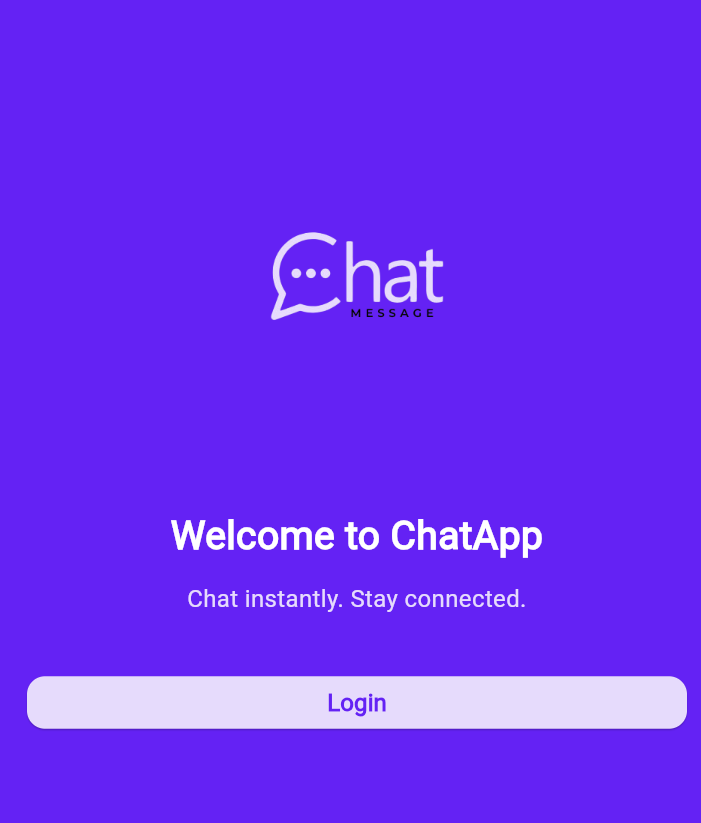
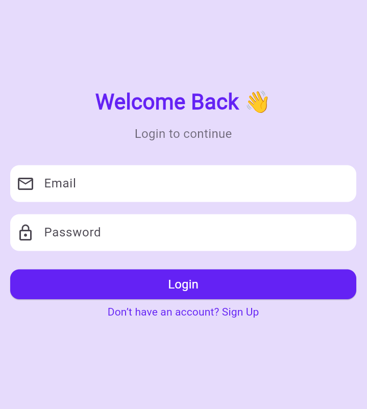
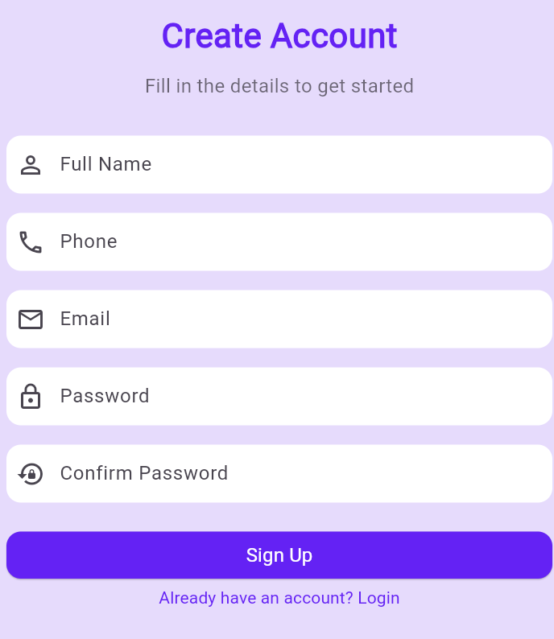
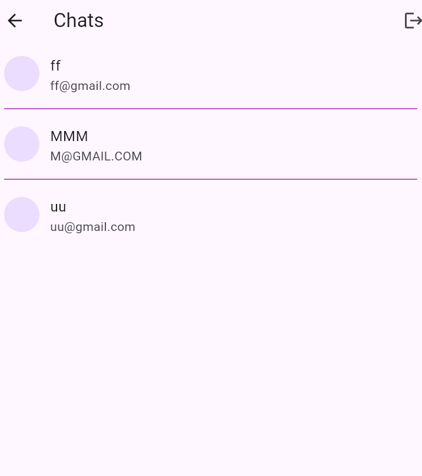
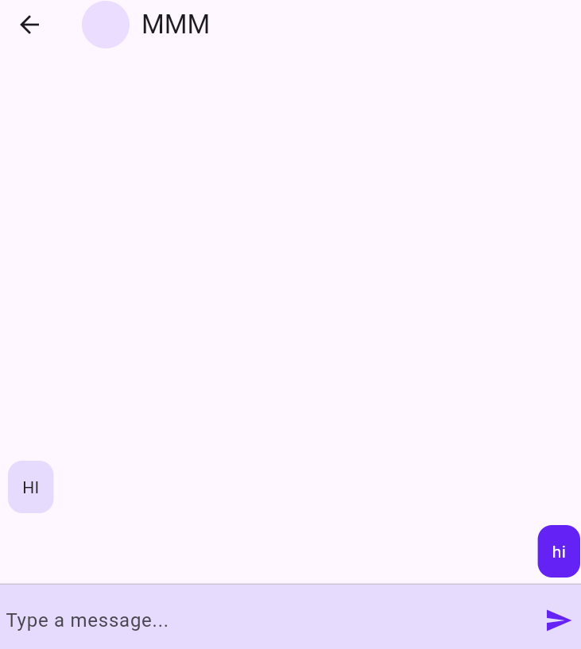

# 💬 Flutter Chat App

A modern real-time **Chat Application** built with **Flutter** and **Firebase**. It includes sign-up, login, user listing, and chat functionality. Messages are stored and retrieved from Firebase Firestore.

---


## ⚙️ Features

- ✅ User Registration and Login with Firebase Auth  
- ✅ Real-time Chat with Firebase Firestore  
- ✅ Chat List showing other registered users  
- ✅ Secure Logout  
- ✅ Minimal, clean UI

---

## 🛠 Tech Stack

| Tech           | Description                             |
|----------------|-----------------------------------------|
| Flutter        | UI Framework for cross-platform apps    |
| Firebase Auth  | User authentication                     |
| Firebase Firestore | Real-time NoSQL database          |
| Firebase Storage | For profile images (optional)         |
| GetX           | For state management and routing        |

---

## 📱 App Preview

<div style="display: flex; flex-wrap: wrap; gap: 10px;">
  
  
  
  
  
</div>

---

## 🚀 Getting Started

### Prerequisites

- Flutter SDK installed  
- Firebase Project setup  
- Emulator or physical device

### 🔧 Setup Instructions

```bash
# Clone the repo
git clone https://github.com/your-username/flutter-chat-app.git

# Navigate to project folder
cd flutter-chat-app

# Get dependencies
flutter pub get

# Run the app
flutter run
